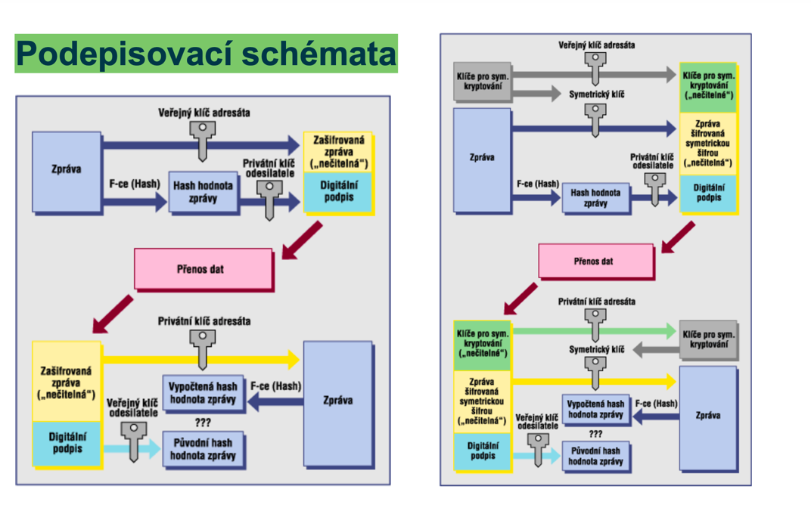

### 1.Prednáška - Úvod do teorie informace
--

#### Úvod
- **Význam informací**: Výměna informací je klíčová pro existenci a fungování společnosti.
- **Zpracování informací**: Neustálý proces, který může být ovlivněn. Zabezpečení informací je důležité pro celou společnost.
- **Efektivní práce s informacemi**: Zahrnuje porozumění, získávání a hodnocení informací, jejich přenos a ukládání.

#### Pojem informace
- **Definice**: Informace je obsah jakéhokoli oznámení nebo údaje určené pro přenos v prostoru a čase.
- **Formy informace**: Může zahrnovat data, čísla, znaky, příkazy, vjemy a podněty přijímané a vysílané živými organismy.

#### Jak informace chápat?
- **Kvalitativní pohled**: Zabývá se významem a obsahem zpráv (informatika).
- **Kvantitativní pohled**: Měření množství informací (teorie informace).

#### Teorie informace
- **Claude Shannon**: Zakladatel teorie informace, definoval informace jako míru neurčitosti nebo nejistoty odstraněnou realizací náhodného děje.
- **Entropie**: Měření množství informací pomocí entropie, což je pojem převzatý z fyziky.

#### Měření informačního množství
- **Entropie**: Střední hodnota vlastních informací jednotlivých realizací jevů.
- **Výpočet vlastní informace**: I(x) = −log p(x), kde p(x) je pravděpodobnost výsledku.

#### Kódování informace
- **Signální komunikační kanál**: Informaci je nutné transformovat, tedy kódovat.
- **Druhy kódování**:
  - Rovnoměrné kódování: Stejně dlouhé kódy pro každý znak, jednodušší, méně hospodárné.
  - Nerovnoměrné kódování: Různě dlouhé kódy, složitější, maximálně hospodárné (Shannon-Fano, Huffman).

### Shannon-Fanův algoritmus _________________________________

- **Postup**: Uspořádání znaků podle pravděpodobnosti, výpočet kumulativních pravděpodobností, rozdělení do skupin, opakování procesu.

### Huffmanovo kódování _________________________________
- **Postup**: Sečtení posledních dvou pravděpodobností, seřazení nového sloupce, přiřazení bitů kódového slova, opakování, dokud se součet nerovná 1.

### Aritmetické kódování _________________________________
- **Princip**: Reprezentace zprávy jako podintervalu intervalu ⟨0, 1), kde se zpřesňuje interval podle pravděpodobností symbolů.
- **Výhoda**: Efektivnější kód, kratší než Huffmanovo kódování, ale pomalejší.

### Shannon-Fanův algoritmus _________________________________

- **Postup**:
  1. **Uspořádání znaků podle pravděpodobnosti**:
    - Seřaďte všechny symboly ve zprávě podle jejich pravděpodobnosti výskytu od nejvyšší po nejnižší.
  2. **Výpočet kumulativních pravděpodobností**:
    - Vypočítejte kumulativní pravděpodobnosti pro každou dvojici symbolů.
  3. **Rozdělení do skupin**:
    - Rozdělte symboly do dvou skupin tak, aby součet pravděpodobností v obou skupinách byl co nejvíce vyvážený.
  4. **Přiřazení bitů**:
    - Přidělte každé skupině bit (0 nebo 1). První skupina dostane 0, druhá 1.
  5. **Rekurzivní opakování procesu**:
    - Opakujte proces pro každou podskupinu, dokud každý symbol nemá svůj jedinečný kód.

Výsledkem je vytvoření kódů pro každý symbol, které jsou efektivní z hlediska průměrné délky kódu.

### Huffmanovo kódování _________________________________

- **Postup**:
  1. **Výpočet pravděpodobností**:
    - Určete pravděpodobnosti výskytu jednotlivých symbolů ve zprávě.
  2. **Seřazení symbolů podle pravděpodobností**:
    - Seřaďte symboly podle jejich pravděpodobností od nejmenší po největší.
  3. **Sečtení posledních dvou pravděpodobností**:
    - Vyberte dva symboly s nejnižšími pravděpodobnostmi a spojte je do nového uzlu s pravděpodobností rovnou součtu jejich pravděpodobností.
  4. **Vytvoření nového sloupce**:
    - Přidejte nový uzel zpět do seznamu a znovu seřaďte symboly.
  5. **Přiřazení bitů kódového slova**:
    - Opakujte proces, přiřazujte bity (0 nebo 1) na základě toho, zda symbol patří do levé nebo pravé podskupiny nového uzlu.
  6. **Opakování, dokud se součet nerovná 1**:
    - Pokračujte v procesu, dokud nezbyde pouze jeden uzel, který reprezentuje celý strom.

Výsledkem je binární strom, kde každý symbol má svůj unikátní prefixový kód. Huffmanovo kódování je známé pro svou efektivnost při vytváření minimálních průměrných délek kódových slov.

### Aritmetické kódování _________________________________

- **Princip**:
  - Aritmetické kódování reprezentuje celou zprávu jako podinterval intervalu ⟨0, 1). Tento interval se zpřesňuje na základě pravděpodobností jednotlivých symbolů ve zprávě.
  - Na začátku je interval nastaven na ⟨0, 1).
  - Pro každý symbol ve zprávě se interval dělí podle jeho pravděpodobnosti a redukuje se na podinterval odpovídající aktuálnímu symbolu.

- **Postup**:
  1. **Inicializace intervalu**:
    - Interval začíná od 0 do 1.
  2. **Pro každý symbol**:
    - Rozdělte aktuální interval na podintervaly, kde každý podinterval je úměrný pravděpodobnosti aktuálního symbolu.
    - Vyberte podinterval odpovídající aktuálnímu symbolu jako nový interval.
  3. **Zpřesnění intervalu**:
    - Pokračujte v procesu zpřesňování intervalu pro každý následující symbol ve zprávě.
  4. **Konečný interval**:
    - Když je zpráva celá zakódována, vyberte libovolné číslo z konečného intervalu jako kód celé zprávy.

- **Výhoda**:
  - Aritmetické kódování může vytvořit kratší kód než Huffmanovo kódování, protože je schopno využít frakční bity k efektivnějšímu kódování symbolů s vysokou pravděpodobností.
  - Přestože je aritmetické kódování teoreticky efektivnější, může být pomalejší na výpočet, což může být nevýhodou v některých aplikacích.

#### Závěr
- **Kódování a dekódování**: Znalost pravděpodobností symbolů je klíčová. Dekódování probíhá úpravou čísla n a přiřazením příslušných symbolů podle intervalu.

#### Shrnutí
- Základy teorie informace se zaměřují na definici a měření informací, principy kódování a jejich efektivitu.
- Shannonova entropie poskytuje způsob, jak kvantifikovat množství informací.
- Kódování je nezbytné pro efektivní přenos informací a zahrnuje různé algoritmy, které optimalizují délku kódu.

### takze co treba vediet
- čo je kodovanie
- symetricke /asymetricke šifrovanie
- shannon-fanuv algortimus
- huffmanovo kodovanie
- aritmeticke kodovanie

---
---

### 2. Prednáška - ÚVod do kryptologie
--
#### Úvod do kryptologie
- **Cíle kryptologie**: Ochrana důvěrnosti, integrity dat, autentizace a autorizace.
- **Základní pojmy**: Kryptografie (šifrování), kryptoanalýza (dešifrování).
- **Třídy kryptografických systémů**: Symetrická a asymetrická kryptografie.

#### Matematický základ kryptologie
- **Modulární aritmetika**: Čísla se cyklicky opakují a operace jsou prováděny s výsledky modulu.
- **Operace XOR**: Logická operace využívaná v kryptografii.
- **Galoisova tělesa**: Konečná tělesa používaná v mnoha šifrovacích algoritmech, jako je AES.

#### Historie kryptografie
- **Klasické šifry**: Menet Khufu, Caesarova šifra, Vigenèrova šifra.
- **Enigma**: Německý šifrovací stroj použitý během druhé světové války. Spojenci ho dokázali částečně dešifrovat díky práci polských a britských kryptoanalytiků.
- **Poválečná kryptografie**: Počítače (Colossus, ENIAC) zrychlily dešifrování. Výpočetně náročné problémy (P ≠ NP) jsou základem moderní kryptografie.

#### Základní principy kryptografie
- **Kerckhoffsův princip**: Bezpečnost systému závisí na utajení klíče, nikoli na utajení algoritmu.
- **Symetrická kryptografie**: Stejný klíč pro šifrování i dešifrování.
- **Asymetrická kryptografie**: Různé klíče pro šifrování a dešifrování, distribuce klíčů je jednodušší.

#### Metody kryptografie
- **Transpozice**: Přeskládání znaků zprávy.
- **Substituce**: Nahrazení znaků zprávy jinými znaky (např. Caesarova šifra, Vigenèrova šifra).

#### Implementace a útoky
- **Útoky na implementaci**: Útoky často cílí na špatnou implementaci kryptografických algoritmů.
- **Postranní kanály**: Analýza provozu, elektromagnetický odposlech, viry a trojští koně.

#### Budoucnost kryptografie
- **Kvantové počítače**: Mohou potenciálně prolomit současné šifrovací algoritmy.
- **Útoky na kryptografii**: Kryptoanalýza, elektromagnetický odposlech, a další útoky na implementaci.

### takze co treba vediet
- kryptologia/kryptografia
- historia -> starovek (hieroglify), stredovek (zdokonalenie substituce), novovek - enigma, vegnerova šifra, playfair šifra

---
---

### 3.Prednáška  Monoalfabetické Substituční Šifry
--

**Úvod:**
- Substituční šifry nahrazují písmena otevřené abecedy písmeny šifrovací abecedy.
- Historie: Objeveny ve starých rukopisech a rozvinuty kolem roku 750 v arabském světě a během renesance v Evropě.

**Caesarova Šifra:-------------------**
- Posun písmen o tři místa vpřed.
- Příklad: "veni vidi vici" → "YHQL YLGL YLFL".

**Šifra ATBAŠ:-------------------**
- Hebrejská šifra nahrazující písmena zrcadlově od konce abecedy.
- Příklad: "kain a abel byli bratri" → "XNVA N NORY OLYV OENGEV".

**Polybiův Čtverec:-------------------**
- Každé písmeno kódované dvojicí čísel (řada a sloupec).
- Příklad: "ikaruvpad" → "21 41 23 45 52 53 11 23 25".

**Šifrovací Kříž:-------------------**
- Používán svobodnými zednáři, různé varianty.

**Obecná Substituce:-------------------**
- Každý znak otevřené abecedy nahrazen jedním znakem šifrové abecedy.
- Příklad: "mundus vult decipi" → "OVHTVL XVYN TKFJRJ".

**Substituce s Klíčem:-------------------**
- Použití klíčového slova pro jednodušší rekonstrukci šifrové abecedy.
- Příklad: "zij vyrovnane" → "ZAB VYOJVHPHK".

**Vylepšení Substitučních Šifer:**
- Použití speciálních symbolů a nulových znaků, zkomolení zprávy.

**Homofonní Šifra:-------------------**
- Písmena nahrazena řadou reprezentací podle frekvence.
- Příklad: "abeceda" → "09 48 14 13 16 01 12".

**Šifra Playfair:-------------------**
- Nahrazuje dvojice písmen v otevřeném textu jinou dvojicí.
- Příklad: "meet me at hamx" → "GD DO GD RQ AR".

**Knižní Šifra:-------------------**
- Použití knihy jako klíče, každé písmeno zašifrováno mnoha různými způsoby.

**Kryptoanalýza:**
- Identifikace šifry, odhalení klíče, rozluštění textu.
- Metody: frekvenční analýza, znalost jazyka, identifikace samohlásek a souhlásek.

**Nepřímé Útoky:**
- Použití intuice, analýza typických frází a struktury zpráv.
- Slabá místa: lidské chyby, intriky, omylem vyzrazené klíče.

### Důležité body k zapamatování:
1. **Substituční šifry** nahrazují písmena abecedy podle specifického pravidla.
2. **Caesarova šifra** je jednoduchý posun písmen.
3. **ATBAŠ šifra** používá zrcadlovou substituci.
4. **Polybiův čtverec** kóduje písmena pomocí dvojice čísel.
5. **Obecná substituce** a **substituce s klíčem** používají předefinovanou abecedu, často s klíčovým slovem.
6. **Homofonní šifra** a **Playfair šifra** jsou pokročilejší substituční metody.
7. **Kryptoanalýza** využívá frekvenční analýzu a jiné techniky k prolomení šifer.
8. **Nepřímé útoky** zahrnují analýzu chyb a odhadování obsahu zprávy na základě kontextu.

### takze co treba vediet
- ake su monoalfebeticke šifry ze su zalozene na substitucii
- cezarova sifra
- sifra ATBAŠ
- polymuv čtverec
- šifrovací kríž
- šifra playfair
- obecna substituce
- substituce kličem
- homofonni šifra
- knižní šifra
- kryptoanalyza - identifikace sifry -> odhaleni klice -> rozluštení (frekvencni analyza, samohlasky/spoluhlasky, hladame časte slova, frekvencia pismen)
---
---
### 4. Prednáška - Polyalfabetické šifry -Náhodná čísla - Transpoziční šifry výcuc
--

### Monoalfabetické šifry a ich kryptoanalýza
- **Caesarova šifra**: posun písmen abecedy o pevný počet miest (napr. o 3). Má len 25 možných kľúčov, čo ju robí ľahko rozluštiteľnou.
- **Vylepšenie**: použitie náhodne usporiadanej šifrovej abecedy, čo zvyšuje počet možných kľúčov.
- **Frekvenčná analýza**: metóda dešifrovania, ktorá využíva častý výskyt určitých písmen v jazyku.

### Polyalfabetické šifry
- **Vigenèrova šifra**: využíva periodicky sa opakujúci kľúč, ktorý je dlhší ako jeden znak. Pomocou Vigenèrova štvorca sa šifruje každý znak otvoreného textu rôznym spôsobom.
  - **Šifrovanie**: klíčové slovo sa opakuje, a každý znak otvoreného textu sa posunie podľa zodpovedajúceho znaku v kľúči.
  - **Kryptoanalýza**: zahŕňa určenie dĺžky kľúča a následné rozdelenie šifrovaného textu na časti, ktoré sú šifrované rovnakým znakom kľúča, čo umožňuje použitie frekvenčnej analýzy.

- **Vernamova šifra (One-time pad)**: využíva kľúč dlhý ako samotný text, ktorý je náhodný a použitý iba raz. Teoreticky nerozlúštiteľná, ak sú splnené podmienky (náhodný kľúč, jednorázové použitie).

### Náhodná čísla
- **Pseudo-random number generators (PRNGs)**: generujú čísla, ktoré vyzerajú náhodne, ale sú deterministické a opakovateľné. Používajú sa na simulácie.
  - **Lineárne kongruenčné generátory**: jednoduché, ale pre kryptografiu nevhodné.
  - **LFSR (Lineárne posuvné registre)**: kombinujú posuvné registre so spätnou väzbou, vhodné na simulácie.

- **True-random number generators (TRNGs)**: generujú skutočne náhodné čísla využitím fyzikálnych javov, ako je rádioaktívny rozpad, šum z mikrofónov alebo kamier.

### Transpozičné šifry
- **Transpozícia**: zmena poradia symbolov v správe podľa určitého pravidla alebo permutácie.
  - **Jednoduché transpozičné šifry**: píšu text do matice a potom ho čítajú po riadkoch alebo stĺpcoch.
  - **Otočné mriežky**: špeciálne mriežky, ktoré sa otáčajú a tým šifrujú text (napr. Fleissnerova mriežka).
  - **Dvojitá transpozícia**: kombinuje dve permutácie na zvýšenie bezpečnosti.

### Superšifrovanie
- **Superšifrovanie**: aplikovanie jednej šifry na výsledok inej šifry (napr. kombinácia substitúcie a transpozície).

### Involúcie
- **Involúcia**: funkcia, ktorá je svojím vlastným inverzom (napr. ROT13). Používa sa v symetrickej kryptografii.

### Kľúčové body
- **Vigenèrova šifra**: poskytuje lepšiu bezpečnosť než monoalfabetické šifry, ale stále je náchylná na kryptoanalýzu pomocou frekvenčnej analýzy opakujúcich sa sekvencií.
- **Vernamova šifra (One-time pad)**: jediná teoreticky nerozlúštiteľná šifra, ale praktické problémy s distribúciou kľúčov obmedzujú jej použitie.
- **PRNGs vs. TRNGs**: PRNGs sú deterministické a použiteľné na simulácie, zatiaľ čo TRNGs poskytujú skutočnú náhodnosť potrebnú pre silnú kryptografiu.
- **Transpozícia**: používaná na zmenu poradia symbolov, často v kombinácii s inými metódami na zvýšenie bezpečnosti.

Tieto základné pojmy a metódy tvoria základ kryptológie a poskytujú základ pre pochopenie moderných šifrovacích techník.

---

Shrnutí 4 prednaska
--
- Jak funguje Vigenèrova šifra?
- Jak se Vigenèrova šifra luští?
- Jak funguje one-time pad?
- Proč je one-time pad nerozluštitelná?
- Jak se generují pseudonáhodná čísla?
- Jaký je princip transpozice?

### Jak funguje Vigenèrova šifra?

Vigenèrova šifra je polyalfabetická substituční šifra, což znamená, že používá více než jednu šifrovací abecedu. Každé písmeno otevřeného textu je zašifrováno pomocí posunu, který je určen klíčovým slovem. Klíčové slovo se opakuje tak, aby odpovídalo délce otevřeného textu.

**Postup šifrování:**

1. **Zvolíme klíčové slovo:** Například "WHITE".
2. **Otevřený text:** Například "DIVERTTROOPSTOEASTRIDGE".
3. **Rozšíření klíčového slova na délku otevřeného textu:** "WHITEWHITEWHITEWHITEWHI".
4. **Šifrování jednotlivých písmen:** Každé písmeno otevřeného textu je posunuto o hodnotu odpovídající písmenu klíčového slova (A = 0, B = 1, ..., Z = 25).

Tabula recta nebo Vigenèrův čtverec se často používá k usnadnění šifrování a dešifrování.

### Jak se Vigenèrova šifra luští?

Luštění Vigenèrovy šifry se skládá z následujících kroků:

1. **Určení délky klíče:**
  - Hledání opakujících se sekvencí v šifrovém textu a určení vzdáleností mezi nimi.
  - Výpočet největšího společného dělitele těchto vzdáleností, což poskytne délku klíče.

2. **Určení klíče:**
  - Rozdělení šifrového textu na části šifrované stejným písmenem klíče.
  - Použití frekvenční analýzy na jednotlivé části textu (každou část šifrovanou jedním písmenem klíče).
  - Identifikace jednotlivých písmen klíče.

3. **Dešifrování textu:**
  - Použití získaného klíče k zpětnému posunu písmen v šifrovém textu.

### Jak funguje one-time pad?

One-time pad (OTP) je metoda šifrování, která používá klíč stejnou délku jako zpráva, kde každý bit nebo znak otevřeného textu je kombinován s odpovídajícím bitem nebo znakem z klíče pomocí operace XOR (exkluzivní OR).

**Postup šifrování:**

1. **Klíč:** Náhodná posloupnost bitů o stejné délce jako otevřený text.
2. **Šifrování:** Pro každý bit otevřeného textu provedeme operaci XOR s odpovídajícím bitem klíče.

**Postup dešifrování:**

1. **Klíč:** Stejný klíč jako použitý pro šifrování.
2. **Dešifrování:** Provádíme operaci XOR na každý bit šifrového textu s odpovídajícím bitem klíče.

### Proč je one-time pad nerozluštitelná?

One-time pad je matematicky prokázáno nerozluštitelná, protože:

1. **Náhodný klíč:** Klíč je náhodný a stejně dlouhý jako zpráva, což znamená, že každé možné zašifrované písmeno je stejně pravděpodobné.
2. **Jedinečný klíč:** Každý klíč se používá pouze jednou, takže není možné získat žádnou informaci z frekvenční analýzy.
3. **Matematická teorie:** Claude Shannon dokázal, že pokud je klíč skutečně náhodný a nikdy se neopakuje, nelze zašifrovanou zprávu bez klíče rozluštit.

### Jak se generují pseudonáhodná čísla?

Pseudonáhodná čísla se generují pomocí algoritmů, které produkují sekvence čísel, které se zdají být náhodné, ale jsou deterministické a opakovatelné.

**Generátory pseudonáhodných čísel (PRNG):**

1. **Lineární kongruenční generátor (LCG):**
   \[
   X_{n+1} = (aX_n + c) \mod m
   \]
  - Parametry \(a\), \(c\) a \(m\) jsou konstanty, \(X_0\) je semeno.

2. **Lineární zpětnovazební posuvné registry (LFSR):**
  - Využívají posuvný registr a zpětnovazební funkci (např. XOR).

**Generátory skutečně náhodných čísel (TRNG):**

- Využívají fyzické jevy, jako je radioaktivní rozpad nebo atmosférický šum, k vytvoření skutečně náhodných sekvencí.

### Jaký je princip transpozice?

Transpoziční šifra mění pořadí znaků v otevřeném textu podle určitého klíče nebo vzoru, ale ponechává samotné znaky nezměněné.

**Příklady transpozičních šifer:**

1. **Jednoduchá sloupcová transpozice:**
  - Text se zapíše do matice po řádcích a čte se po sloupcích podle klíče.

2. **Otočná mřížka:**
  - Používá mřížku s otvory, kterou se několikrát otočí, a postupně se vyplňují písmena textu do odhalených polí.

Transpoziční šifry jsou často kombinovány se substitučními šiframi, aby se dosáhlo vyšší bezpečnosti, například v superšifrování.

### takze co treba vediet
- ake su polyalfabeticke šifry
- vigenèrova šifra
- vernamova šifra (one-time pad)
- pseudo-random number generators (PRNGs)
- true-random number generators (TRNGs)
- transpozičné šifry
- involúcie
- superšifrovanie

---
---

## 5-6.Prednáška - Moderní symetrické kryptosystémy
--

1. **Úvod do symetrických kryptosystémov:**
  - Symetrické kryptosystémy používajú rovnaký kľúč na šifrovanie aj dešifrovanie dát.
  - Kľúč je kritickým aspektom týchto systémov, pretože jeho utajenie je nevyhnutné na zachovanie bezpečnosti.
  - Primárna výhoda symetrických šifier je ich rýchlosť a efektívnosť pri spracovaní veľkých objemov dát.

2. **Rozdelenie algoritmov:**
  - Symetrické kryptosystémy môžeme rozdeliť do dvoch hlavných kategórií: proudové šifry a blokové šifry.
  - Proudové šifry spracovávajú dáta postupne, bit po bite, zatiaľ čo blokové šifry pracujú s dátovými blokmi.
  - Táto klasifikácia ovplyvňuje vlastnosti a použitie jednotlivých typov šifier.

3. **Vlastnosti blokových a proudových šifier:**
  - Blokové šifry, ako napríklad DES (Data Encryption Standard) a AES (Advanced Encryption Standard), šifrujú dáta po blokoch.
  - Výhodou blokových šifier je ich schopnosť poskytovať "difúziu" a "konfúziu", čo sú dôležité koncepty v kryptografii.
  - Proudové šifry, ako napríklad RC4, operujú na jednotlivých bitoch alebo bytoch dát.
  - Aj keď sú proudové šifry rýchle a efektívne, môžu byť zraniteľnejšie voči niektorým typom útokov ako blokové šifry.

4. **Príklady a použitie:**
  - Príklady proudových šifier zahŕňajú RC4, ktorý bol používaný v protokole SSL/TLS a v bezdrôtovej sieti WEP (Wired Equivalent Privacy).
  - Blokové šifry ako DES a AES sú široko využívané v rôznych aplikáciách vrátane šifrovania súborov, dátových prenosov a komunikácie.

5. **Módy blokových šifier:**
  - Módy ako ECB (Electronic Codebook) a CBC (Cipher Block Chaining) definujú spôsob, ako blokové šifry spracovávajú dáta.
  - ECB šifruje každý blok nezávisle, čo môže viesť k istým bezpečnostným problémom, ak sa používa nesprávne.
  - CBC je robustnejší režim, ktorý zahrňuje spätnú väzbu z predchádzajúceho bloku do šifrovania nasledujúceho bloku.

6. **Šifra RC4:**
  - RC4 bol populárnou proudovou šifrou v minulosti, ale dnes sa neodporúča kvôli objaveným slabostiam v jeho implementácii.
  - Používal sa v rôznych aplikáciách vrátane bezpečnostných protokolov ako SSL/TLS a vo WEP pre bezdrôtovú komunikáciu.

7. **DES (Data Encryption Standard):**
  - DES bol prvým štandardizovaným blokovým kryptografickým algoritmom.
  - Používa 64-bitové kľúče, 16 kôl a kombináciu operácií ako permutácie, substitúcie a rozšírenia.
  - Napriek svojej histórii má DES dnes obmedzenú použiteľnosť kvôli svojej krátkej dĺžke kľúča a niektorým známym slabostiam.

8. **DES Cracker:**
  - DES Cracker bol výpočtový nástroj, ktorý bol navrhnutý na lámanie DES šifier hrubou silou.
  - Jeho úspešné použitie naštartovalo diskusiu o bezpečnosti DES a potrebe prechodu na silnejšie algoritmy.

9. **Bezpečnosť a perspektívy:**
  - S narastajúcou výpočtovou silou je dôležité, aby kryptografické algoritmy udržiavali krok s rastúcimi hrozbami.
  - Minimálna dĺžka kľúča 128 bitov sa teraz považuje za štandard, smerujúc k ešte dlhším kľúčom pre lepšiu bezpečnosť.
  - Neustále inovácie v oblasti kryptografie sú kľúčom k udržaniu dátových komunikácií a údajov bezpečných.

### takze co treba vediet
- co su symetrické kryptosystémy
- rozdelenie algoritmov na blokové a proudové šifry
- vlastbistu proudových šifier (rychle, jednuche pre implementaciu, - RC4)
- RC4 - proudova šifra používaná v SSL/TLS a WEP, 256 bitový klúč, slabosti v implementacii, fáze: inicializácie, pracovní - generovanie pseudonáhodných čísel
- vlastnosti blokových šifier (pomalsie, narocnejsie na implementaciu, dobrý navrh, difúzia a konfúzia, DES, AES)
  - blokove operace - substitúcia, permutácia, rotace, aritmetické operácie
- príklady a použitie blokových a proudových šifier
- módy blokových šifier (ECB, CBC)
- šifra RC4
- DES (Data Encryption Standard)
- DES Cracker
- bezpečnost a perspektivy symetrických kryptosystémov
- co je to ECB a CBC

---
----
## 7.Prednáška - Certifikace klíčů, Hashovací funkce
--

1. **Asymetrická kryptografia**:
  - Používa pár kľúčov: verejný a súkromný.
  - Tajné správy sa šifrujú verejným kľúčom príjemcu a dešifrujú sa jeho súkromným kľúčom.
  - Zabezpečenie autenticity sa dosahuje digitálnym podpisom, kde sa správa šifruje súkromným kľúčom odosielateľa.

### Popis podpisovacích schémat

#### Schéma vľavo

1. **Generovanie hashu správy**:
  - Správa sa preženie hashovacou funkciou (F-ce (Hash)), ktorá vytvorí hash hodnotu správy.

2. **Digitálny podpis**:
  - Hash hodnota správy sa zašifruje súkromným kľúčom odosielateľa, čím vznikne digitálny podpis.

3. **Prenos dát**:
  - Digitálny podpis sa pripojí k správe a obe sa odošlú adresátovi.

4. **Overenie podpisu**:
  - Adresát dešifruje digitálny podpis verejným kľúčom odosielateľa, čím získa hash hodnotu správy.
  - Správu preženie rovnakou hashovacou funkciou, aby získal pôvodný hash.
  - Porovná vypočítaný hash s hashom získaným z podpisu. Ak sa zhodujú, podpis je platný a správa nebola zmenená.

#### Schéma vpravo

1. **Generovanie hashu správy**:
  - Správa sa preženie hashovacou funkciou (F-ce (Hash)), ktorá vytvorí hash hodnotu správy.

2. **Digitálny podpis**:
  - Hash hodnota správy sa zašifruje súkromným kľúčom odosielateľa, čím vznikne digitálny podpis.

3. **Šifrovanie správy**:
  - Správa sa zašifruje symetrickým kľúčom (ktorý bol zašifrovaný verejným kľúčom adresáta) a stáva sa nečitateľnou.

4. **Prenos dát**:
  - Zašifrovaná správa a digitálny podpis sa odošlú adresátovi.

5. **Dešifrovanie správy**:
  - Adresát dešifruje symetrický kľúč svojim súkromným kľúčom.
  - Následne dešifruje správu pomocou symetrického kľúča.

6. **Overenie podpisu**:
  - Adresát dešifruje digitálny podpis verejným kľúčom odosielateľa, čím získa hash hodnotu správy.
  - Správu preženie rovnakou hashovacou funkciou, aby získal pôvodný hash.
  - Porovná vypočítaný hash s hashom získaným z podpisu. Ak sa zhodujú, podpis je platný a správa nebola zmenená.

Tieto podpisovacie schémata kombinujú asymetrickú kryptografiu na vytváranie a overovanie digitálnych podpisov s symetrickou kryptografiou na šifrovanie samotnej správy. Tým sa zabezpečuje autentickosť, integrita a dôvernosť komunikácie.

--

Nie úplne. Obe schémy využívajú kombináciu asymetrického a symetrického šifrovania, ale rozdielne v spôsobe, akým ich implementujú.

### Schéma vľavo:
1. **Asymetrické šifrovanie na digitálny podpis**:
  - Hash správy je zašifrovaný súkromným kľúčom odosielateľa, čo vytvára digitálny podpis.
  - Tento digitálny podpis a pôvodná (nešifrovaná) správa sa odošlú adresátovi.
2. **Asymetrické šifrovanie na overenie podpisu**:
  - Adresát dešifruje digitálny podpis pomocou verejného kľúča odosielateľa a získa hash správy.
  - Adresát tiež vypočíta hash z prijatej správy a porovná ho s dešifrovaným hashom z podpisu.

### Schéma napravo:
1. **Symetrické šifrovanie na zašifrovanie správy**:
  - Správa je najprv zašifrovaná symetrickým kľúčom.
  - Symetrický kľúč je zašifrovaný verejným kľúčom adresáta.
  - Hash správy je zašifrovaný súkromným kľúčom odosielateľa, čím vzniká digitálny podpis.
2. **Asymetrické šifrovanie na prenos symetrického kľúča**:
  - Zašifrovaná správa, zašifrovaný symetrický kľúč a digitálny podpis sú odoslané adresátovi.
  - Adresát dešifruje symetrický kľúč pomocou svojho súkromného kľúča.
3. **Symetrické šifrovanie na dešifrovanie správy**:
  - Adresát dešifruje správu pomocou symetrického kľúča.
  - Hash správy overí dešifrovaním digitálneho podpisu verejným kľúčom odosielateľa a porovnaním so skutočným hashom správy.

### Zhrnutie:
- **Schéma vľavo**: Používa asymetrické šifrovanie pre digitálny podpis a nešifrovanú správu na prenos.
- **Schéma napravo**: Kombinuje asymetrické šifrovanie na prenos symetrického kľúča a symetrické šifrovanie na zabezpečenie samotnej správy, pričom digitálny podpis je zabezpečený asymetricky.

Obe schémy teda využívajú asymetrické šifrovanie, ale schéma napravo tiež zahŕňa symetrické šifrovanie na zabezpečenie samotnej správy.

--

3. **Certifikácia kľúčov**:
  - Motivácia je ochrana pred man-in-the-middle útokmi.
  - Dva prístupy: Sieť dôvery (Web of Trust) a Dôveryhodná tretia strana (Trusted Third Party, TTP).
  - Sieť dôvery je založená na transitivej dôvere, kde užívatelia certifikujú kľúče iných užívateľov.
  - TTP je certifikačná autorita, ktorá potvrdzuje autenticitu podpisu a tým aj identitu jeho držiteľa.

3. **Hierarchia certifikátov**:
  - Certifikačné autority (CA) vytvárajú certifikáty, ktoré spájajú verejný kľúč s identitou držiteľa.
  - Public Key Infrastructure (PKI) je systém usporiadania a správy týchto certifikátov.
  - Kořenový certifikát je základný certifikát, ktorý nie je nikým iným certifikovaný a aplikácia musí rozhodnúť, ktorým CA veriť.

4. **Autenticita**:
  - Pravosť a dôveryhodnosť užívateľov, správ a hesiel.
  - MAC (Message Authentication Code) potvrdzuje pravosť správy a kontroluje, či nebola počas prenosu zmenená.

#### Hashovacie funkcie

1. **Vlastnosti hashovacích funkcií**:
  - Deterministické: rovnaký vstup vždy dáva rovnaký výstup.
  - Jednosmerné: ťažko získať pôvodný vstup zo známeho hashu.
  - Odolnosť voči kolíziám: ťažké nájsť dva rôzne vstupy s rovnakým hashom.

2. **Použitie hashovacích funkcií**:
  - Digitálne podpisy a MAC.
  - Indexovanie a identifikácia dát.
  - Kontrolné súčty a overovanie hesiel.
  - Proof of Work a generovanie náhodných čísel.

3. **Algoritmy**:
  - **MD5**: 128-bitový hash, teraz neodporúčaný pre kryptografické aplikácie kvôli nájdeným zraniteľnostiam.
  - **SHA-1**: 160-bitový hash, kompromitovaný a od roku 2010 neodporúčaný.
  - **SHA-2**: Výstup 224, 256, 384 alebo 512 bitov, zatiaľ bezpečný.
  - **SHA-3**: Využíva princíp houbovej funkcie, vybraný v súťaži v rokoch 2006-2015.

4. **Konstrukčné princípy**:
  - **Merkle-Damgårdova konstrukce**: Použitá v MD5, SHA-0, SHA-1, SHA-2.
  - **Houbová funkce (sponge function)**: Využíva stavovú pamäť rozdelenú na bitrate a capacity, transformuje vstup a produkuje výstup.

#### Aplikácie a bezpečnostné hľadiská

- Hashovacie funkcie sú kľúčové pre bezpečnú autentizáciu, zabezpečenie integrality dát a efektívne indexovanie.
- Ich správna implementácia a použitie je zásadné pre zabezpečenie kryptografických systémov a ochranu proti útokom, ako sú kolízie a predikcie hashov.

Merkle-Damgårdova konstrukce
-

Merkle-Damgårdova konstrukce je metodika na vytváranie kryptografických hashovacích funkcií, ktorá zabezpečuje, že hashovacia funkcia môže spracovať správy ľubovoľnej dĺžky a poskytovať pevne stanovený výstup (hash) fixnej veľkosti.

#### Kľúčové komponenty a kroky Merkle-Damgårdovej konstrukce:

1. **Padding (doplnkovanie)**:
  - Správa sa najprv doplní (padding) tak, aby jej dĺžka bola násobkom určitej blokovej veľkosti (napr. 512 bitov).
  - Padding zvyčajne zahŕňa pripojenie jedného bitu '1', nasledovaného potrebným počtom bitov '0', a nakoniec pripojením dĺžky pôvodnej správy v bitoch.

2. **Inicializačný vektor (IV)**:
  - Používa sa pevne stanovený inicializačný vektor, ktorý slúži ako východisková hodnota pre prvý blok. Je to zvyčajne pevne určený bitový reťazec.

3. **Iteratívne spracovanie blokov**:
  - Správa je rozdelená do blokov fixnej veľkosti (napr. 512 bitov).
  - Každý blok je postupne spracovaný kompresnou funkciou, ktorá kombinuje aktuálny blok s výsledkom z predchádzajúceho bloku (alebo inicializačného vektora pre prvý blok).

4. **Kompresná funkcia**:
  - Kompresná funkcia vezme dva vstupy: aktuálny blok správy a výsledok z predchádzajúceho bloku (alebo IV).
  - Výstupom kompresnej funkcie je hashová hodnota, ktorá slúži ako vstup pre ďalší blok.

5. **Finalizácia**:
  - Po spracovaní všetkých blokov sa posledná hash hodnota stáva výsledným hashom celej správy.

#### Proces Merkle-Damgårdovej konstrukce

1. **Padding**:
  - Pripojí sa padding, aby dĺžka správy bola násobkom 512 bitov (alebo inej blokovej veľkosti). Pripojenie paddingu zaistí, že správa má vždy rovnaký počet blokov na spracovanie.
  - Napríklad, ak správa má dĺžku 1000 bitov a bloková veľkosť je 512 bitov, doplní sa padding na 1024 bitov (násobok 512).

2. **Inicializácia**:
  - Použije sa inicializačný vektor (IV), čo je fixná hodnota závislá na konkrétnej hashovacej funkcii.

3. **Iterácia cez bloky**:
  - Každý blok správy sa spracuje postupne:
    - Prvý blok sa skombinuje s IV pomocou kompresnej funkcie.
    - Výstup kompresnej funkcie pre prvý blok sa použije ako vstup pre kompresnú funkciu druhého bloku.
    - Tento proces sa opakuje pre všetky bloky správy.

4. **Konečný hash**:
  - Po spracovaní posledného bloku sa výsledná hash hodnota stáva konečným hashom správy.

#### Dôležité vlastnosti Merkle-Damgårdovej konstrukce:
- **Odolnosť voči kolíziám**: Je ťažké nájsť dve rôzne správy, ktoré majú rovnaký hash.
- **Odolnosť voči pre-imagingu**: Je ťažké nájsť pôvodnú správu, ak je známy iba jej hash.
- **Odolnosť voči druhému pre-imagingu**: Je ťažké nájsť druhú správu s rovnakým hashom ako daná správa.

### Príklad
Hashovacie funkcie ako MD5, SHA-1 a SHA-2 využívajú Merkle-Damgårdovu konstrukci na zabezpečenie kryptografických vlastností.

Záverom, Merkle-Damgårdova konstrukce je základná metodika, ktorá zabezpečuje, že hashovacie funkcie môžu spracovať vstupy ľubovoľnej dĺžky a generovať fixný výstup, ktorý je odolný voči rôznym typom kryptografických útokov.

Houbová funkce (Sponge Function) - Stručný prehľad
-
#### Definícia
Houbová funkce je univerzálna kryptografická konštrukcia využívaná na vytváranie hashovacích funkcií, generátorov náhodných čísel a autentifikačných kódov správ.

#### Kľúčové komponenty
1. **Stavová pamäť (state)**:
  - Rozdelená na dve časti: **bitrate (r)** a **capacity (c)**.
2. **Permutačná funkcia (f)**:
  - Transformuje stavovú pamäť počas absorpčnej a squeezing fázy.

#### Proces
1. **Inicializácia**:
  - Stavová pamäť sa inicializuje na nulu alebo pevnú hodnotu.

2. **Absorpčná fáza**:
  - Vstupná správa sa rozdelí na bloky veľkosti bitrate.
  - Každý blok sa XOR-uje s bitrate časťou stavovej pamäti a následne sa stav transformuje funkciou \(f\).

3. **Squeezing fáza**:
  - Po spracovaní všetkých vstupných blokov sa generuje výstup čítaním z bitrate časti stavovej pamäti.
  - Po každom výstupe sa stav opäť transformuje funkciou \(f\), až kým sa nevyprodukuje požadovaná dĺžka výstupu.

#### Vlastnosti
- **Flexibilita**: Spracováva správy a generuje výstupy ľubovoľnej dĺžky.
- **Bezpečnosť**: Zabezpečená veľkosťou capacity a odolnosťou permutačnej funkcie.
- **Jednoduchosť**: Jednoduchá a univerzálna konštrukcia vhodná pre rôzne kryptografické aplikácie.

#### Príklady
- **SHA-3**: Štandardná hashovacia funkcia využívajúca houbovú konštrukciu.
- **Keccak**: Algoritmus implementujúci houbovú funkciu, základ SHA-3.

Houbová funkce je efektívna a bezpečná metóda pre moderné kryptografické aplikácie vďaka svojej univerzálnosti a robustným bezpečnostným vlastnostiam.

-----

## Shrnutí 7. prednaska

### Certifikace klíčů

**Proč je třeba zavádět certifikaci klíčů?**
Certifikace klíčů je nezbytná pro zajištění důvěryhodnosti a autenticity veřejných klíčů. Bez certifikace může být veřejný klíč podvržen, což vede k útokům typu man-in-the-middle, kde útočník podvrhne svůj klíč místo skutečného klíče příjemce  .

### Dva přístupy k certifikaci
1. **Web of Trust (Síť důvěry)**:
  - Myšlenku sítě důvěry zavedl Phil Zimmermann v rámci PGP (Pretty Good Privacy).
  - V síti důvěry každý uživatel může certifikovat klíče jiných uživatelů, což znamená, že digitálně podepisuje tvrzení „Jsem si jistý, že tento klíč patří tomuto uživateli“.
  - Důvěra je tranzitivní, což znamená, že pokud někdo důvěřuje jednomu uživateli, může také důvěřovat klíčům, které tento uživatel certifikoval  .

2. **Důvěryhodná třetí strana (TTP)**:
  - Certifikační autorita (CA) je důvěryhodná třetí strana, která potvrzuje autentičnost podpisu a tím identitu držitele klíče.
  - Certifikační autorita vydává certifikáty, které svazují veřejné klíče s identitami jednotlivců nebo organizací v rámci infrastruktury veřejných klíčů (PKI - Public Key Infrastructure)  .

### Autentičnost
Autentičnost zajišťuje, že pouze odesílatel, který zná tajný klíč, může vytvořit platný digitální podpis. Tento podpis je důkazem, že zprávu skutečně odeslal držitel daného tajného klíče, což zajišťuje nepopiratelnost ze strany odesílatele. Autentičnost také zabraňuje tomu, aby příjemce modifikoval zprávu a stále měl platný podpis  .

### Hashovací funkce

**Merkle-Damgårdova konstrukce**
- Jedná se o základní konstrukční metodu používanou k vytváření kryptografických hashovacích funkcí.
- Funguje tak, že se vstupní zpráva nejprve rozdělí na pevně velké bloky. Každý blok je poté postupně zpracováván kompresní funkcí, která kombinuje předchozí stav hashovací funkce s aktuálním blokem zprávy.
- Výsledkem je konečná hash hodnota, která reprezentuje celou vstupní zprávu .

Tyto klíčové body shrnují důvody a přístupy k certifikaci klíčů, význam autentičnosti, a vysvětlují základní konstrukční princip Merkle-Damgårdovy hashovací funkce.

---
---

## 8.Prednáška - Asymetrická kryptografie
--
### Problém výmeny kľúčov
- **Historický problém**: Výměna tajných kľúčov medzi odosielateľom a prijímateľom, aby tretia strana nemohla odpočúvať. Používanie kurýrů na distribúciu kľúčov predstavovalo logistický problém.
- **Elektronická komunikácia**: Situácia sa zhoršila s príchodom elektronickej komunikácie a obchodovania.
- **Diffie-Hellman-Merkle**: Tento systém vyžadoval synchronizáciu, čo nebolo vždy praktické.

### Asymetrická kryptografia
- **Definícia**: Myšlenku načrtol Whitfield Diffie v roku 1975. Používa dva rôzne kľúče - jeden na šifrovanie (verejný) a druhý na dešifrovanie (súkromný).
- **Princíp**: Jednosmerné funkcie, kde verejný kľúč zašifruje správu a súkromný ju dešifruje.
- **Kľúčový pár**: Každý používateľ si vytvorí pár kľúčov (verejný a súkromný), verejný kľúč distribuuje, súkromný si ponecháva.

### Analógia so zámkami
- **Príklad**: Alice distribuuje kópie zámku, kľúč si ponechá. Bob zamkne správu zámkom a pošle ju Alici, ktorá ju odomkne svojím kľúčom.

### Základné princípy
- **Kľúče**: Verejný kľúč na šifrovanie, súkromný na dešifrovanie. Umožňuje asynchrónnu komunikáciu bez potreby zdieľania tajného kľúča.
- **Použitie**: Šifrovanie správ a ich podpisovanie (overenie pôvodu).

### Typy asymetrických systémov
- **Požiadavky**: Súkromný kľúč nesmie byť v rozumnom čase odvodený z verejného. Používajú sa matematické problémy s exponenciálnou obtiažnosťou, napríklad faktorizácia čísel alebo diskrétny logaritmus.

### RSA
- **História**: Prvá použiteľná asymetrická metóda, vyvinutá v roku 1977. Tvůrci – Rivest, Shamir, Adelman.
- **Tvorba kľúčového páru**: Zvoľte dve veľké prvočísla, vypočítajte ich súčin (modul) a Eulerovu funkciu. Zvoľte číslo e (verejný kľúč) a d (súkromný kľúč), ktoré spĺňajú určité matematické podmienky.
- **Šifrovanie a dešifrovanie**: Zpráva je prevedená na číslo a zašifrovaná pomocou verejného kľúča. Pôvodná zpráva je dešifrovaná súkromným kľúčom.

### Bezpečnosť RSA
- **Faktory bezpečnosti**: Utajenie prvočísel p a q, obtiažnosť faktorizácie n, nedostatok algebraických techník na odvodenie súkromného kľúča.
- **Veľkosť kľúčov**: Kľúč by mal byť dostatočne veľký (1024–2048 bitov), aby bol bezpečný.

### Rýchlosť
- **Porovnanie**: Asymetrická kryptografia je pomalšia ako symetrická. Používa sa pre krátke správy alebo na prenos symetrických kľúčov.
- **Hybridný systém**: Tajná zpráva je šifrovaná symetrickým algoritmom, symetrický kľúč je šifrovaný asymetrickým algoritmom a prenesený spolu s šifrovanou správou.

### Útoky na RSA
- **Metódy**: Faktorizácia čísla n, narušenie generátora prvočísel, nové matematické objavy.
- **Problém malého exponentu**: Volba malého šifrovacieho exponentu (napr. 3) môže viesť k zraniteľnostiam, ktoré umožňujú získať pôvodnú správu z viacerých zašifrovaných správ.

---
---

### 9.Prednáška - Blockchain a kryptomeny

#### Úvod
- **Kryptomeny**: Bitcoin, Ethereum.
- **Klasifikácia blockchainu**: Verejný, súkromný, s povolením.

#### Dátové štruktúry s využitím hash pointerov
- **Blockchain**: Reťazec blokov obsahujúcich dáta, časové pečiatky a hash predchádzajúceho bloku.
- **Merkelův strom**: Binárny strom, kde každá transakcia je hashovaná a páry transakcií sú opäť hashované.

#### Konsenzuálne algoritmy
- **Proof of Work (PoW)**: Náročné na výpočet, ľahké na overenie.
- **Proof of Stake (PoS)**: Šanca na vytvorenie bloku závisí od množstva vlastnených mincí.

#### Transakcie a ťažba
- **Transakcie**: Vstupy a výstupy, kde adresa peňaženky je verejný kľúč.
- **Ťažba**: Proces vytvárania nových blokov, kde prvá transakcia v bloku vytvára nové mince.

#### Možné útoky
- **Útoky na jednotlivcov**: Odcudzenie peňaženky, deanonymizácia, odpočúvanie sieťového prevádzky.
- **Útoky na systém**: DoS útoky, otrávenie blockchainu, 51% útok.

#### Využitie blockchainu
- **Výhody**: Decentralizácia, bezpečnosť, nemennosť dát.
- **Nevýhody**: Vysoká spotreba energie, nízka kapacita transakcií, volatilita.

### Dôležité body
1. **Blockchain a kryptomeny** sú založené na decentralizovanej sieti, kde konsenzus je dosahovaný pomocou rôznych algoritmov ako PoW a PoS.
2. **Bitcoin** bol prvou kryptomenou, ktorú predstavil Satoshi Nakamoto v roku 2008.
3. **Ethereum** zaviedol koncept chytrých kontraktov a decentralizovaných aplikácií.
4. **Bezpečnosť blockchainu** je založená na kryptografických hashovacích funkciách a konsenzuálnych mechanizmoch.
5. **Ťažba** je kľúčový proces pre udržanie a zabezpečenie blockchain siete, ale je energeticky náročná.
6. **Útoky na blockchain** môžu byť rôzne, od krádeže kľúčov až po útoky na samotný systém (napr. 51% útok).
7. **Výhody a nevýhody** blockchain technológie závisia na konkrétnom použití a type blockchainu (verejný vs. súkromný).

Táto prednáška poskytuje komplexný prehľad o blockchain technológii, kryptomenách, ich využití, výhodách, nevýhodách a potenciálnych rizikách.

---
---

## 9.Prednáška - Steganografie
--

### Co je to steganografie
Steganografie je umění a věda o ukrývání samotné existence zprávy. Původ slova je z řečtiny, kde "stegos" znamená skrytý a "graphein" psát. Na rozdíl od kryptografie, která zprávu šifruje, steganografie ji činí nenápadnou tím, že ji ukrývá do jiných nosičů, jako jsou texty, obrázky, zvuky, videa nebo spustitelné soubory.

### Historie steganografie
- **Antika**:
  - Damaratus použil metodu ukrývání zprávy pod voskem na prázdných psacích destičkách (Bitva u Salamíny, 480 př.n.l.).
  - Histiaios napsal zprávu na oholenou hlavu posla, která byla po dorůstání vlasů neviditelná.
- **Středověk**:
  - Giovanni Porta používal speciální inkoust, kterým psal na vajíčka, takže zpráva pronikla na bílek po uvaření natvrdo.
- **Druhá světová válka**:
  - Používaly se mikrotečky a nulové zprávy, což byly bezvýznamné zprávy nesoucí skrytou informaci.

### Metody steganografie
1. **Ukrývání do textu**:
  - **Pomocí bílých znaků**: Ukrytí zprávy mezi běžné texty pomocí bílých znaků (mezery, tabulátory).
  - **Podobné písmena**: Používání písmen, které vypadají podobně, ale mají různé binární hodnoty.
  - **Gramatika a sémantika**: Vytvoření textu s nesmyslnými gramatickými nebo sémantickými konstrukcemi, které nesou skrytou zprávu.
  - **Baconova šifra**: Využití různého fontu nebo stylu písma k zakódování zprávy.
  - **Posouvání řádků nebo slov v PDF dokumentech**: Skrytí zprávy úpravou formátování textu v dokumentech.

2. **Ukrývání do obrázků**:
  - **Least Significant Bit (LSB)**: Změna nejméně významného bitu každého pixelu, což je nepozorovatelné lidským okem.
  - **Barevná paleta**: Přeskupování barev v paletě, aby obraz zůstal vizuálně identický.
  - **Transformační domény**: Ukrytí zprávy v transformačních doménách jako je Discrete Cosine Transform (DCT), používaná v JPEG kompresi.

3. **Ukrývání do zvuku**:
  - **Least Significant Bit (LSB)**: Podobná metoda jako u obrázků, kde se nejméně významné bity zvukového souboru mění.
  - **Frekvence**: Modulace na neslyšitelnou frekvenci nebo v rámci slyšitelného spektra, kde změna je nenápadná.
  - **Kontrola parity**: Použití bitů pro kontrolu parity k ukrytí zprávy.
  - **Fázový posun**: Upravování fázového posunu elementárních funkcí, což je pro lidské ucho nepostřehnutelné.

4. **Ukrývání do videa**:
  - Kombinace technik ukrývání do obrázků a zvuku, protože video obsahuje oba formáty. Například LSB v každém snímku videa nebo v audio stopě.

5. **Ukrývání do spustitelných souborů**:
  - Využití nepoužitých částí kódu a instrukcí skoku, které se neprovedou, pro ukrytí zprávy. Tyto části mohou být rozpoznatelné pouze specifickým analyzátorem.

### Stegoanalýza
Stegoanalýza je proces detekce skrytých zpráv ve steganografických nosičích. Je obtížná, protože neexistuje jediný způsob ukrývání zpráv, a je potřeba vědět, kde skrytou zprávu hledat. Existují dvě hlavní metody:
- **Statistická analýza**: Zkoumání statistických vlastností nosiče a hledání odchylek.
- **Behaviorální analýza**: Sledování chování nosiče, například změny v chování aplikací nebo systémů.

### Použití steganografie
- **V zemích, kde je kryptografie ilegální**: Ukrytí zpráv bez použití šifrování.
- **Ukrytí samotné existence zprávy**: Zajištění, aby nikdo nezjistil, že vůbec existuje komunikace.
- **Tajné služby a soukromé firmy**: Ochrana autorských práv, ochrana obchodních údajů, ukrytí informací ve screenshots nebo digitálních obrazech.

### Výhody a nevýhody
- **Výhody**:
  - Skrytá zpráva nebudí pozornost.
  - Může přežít určité manipulace a transformace (například kompresi).
- **Nevýhody**:
  - Pokud je steganografická zpráva odhalena, útočník získá celou zprávu.
  - Je potřeba kombinovat se šifrováním, aby se zajistila bezpečnost zprávy i po jejím odhalení.

### Kombinace steganografie a kryptografie
Pro zvýšení bezpečnosti je vhodné zprávu nejprve zašifrovat a poté ukrýt pomocí steganografie. Tím se zajistí, že i pokud bude skrytá zpráva odhalena, její obsah zůstane nečitelný bez dešifrovacího klíče.

Toto jsou podrobné informace pokrývající základní pojmy, historii, metody, stegoanalýzu, použití, výhody a nevýhody steganografie, stejně jako kombinaci se šifrováním pro zvýšení bezpečnosti.
